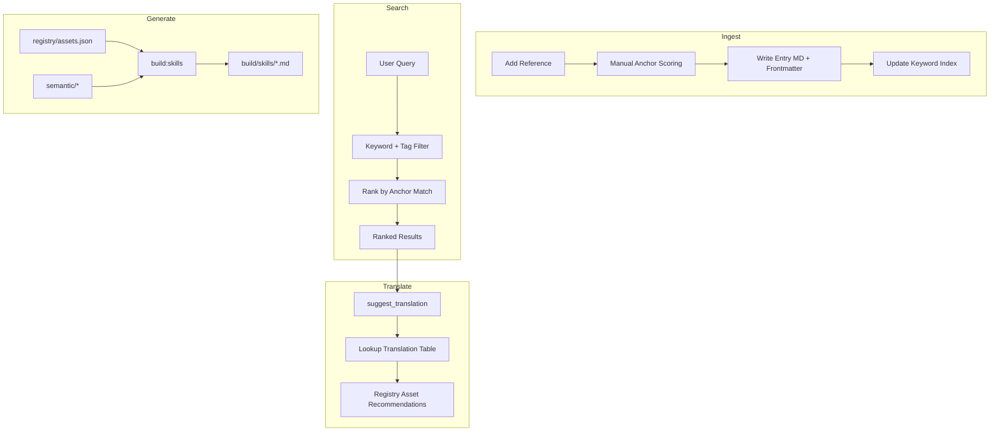

# Semantic Brandworld Upgrade

## Goals

- Make Thoughtform "semantic design" executable: **semantic principles → primitives/tokens → interface patterns → components → platform dialects**.
- Turn Brand World into an **interpreting system** (not a folder of static artifacts): you can add a reference and the system can recommend *how* to use it and *what Thoughtform assets* it maps to.
- Keep **Structure** and **Signal** as parallel systems (per your philosophy doc): particle math must not dictate spacing/margins.
- **Registry is source of truth**; skill files are generated from it.

## Key constraints (locked)

- **Distribution**: docs-first in this repo (no published packages yet), but structure should make packaging easy later.
- **V1 search**: Manual anchor tagging + keyword/tag filtering. Ship fast, refine schema.
- **V2 search** (when library > 200 items): Voyage embeddings (text + code + multimodal).
- **Reference assets**: hybrid storage — previews + metadata in repo, originals in Dropbox.

---

## Proposed repo shape

```javascript
.thoughtform-brandworld/
├── semantic/                    # Meaning layer (stable, rarely changes)
│   ├── anchors/                 # Canonical anchor definitions
│   │   ├── NAVIGATION.md
│   │   ├── THRESHOLD.md
│   │   ├── INSTRUMENT.md
│   │   ├── LIVING_GEOMETRY.md
│   │   ├── GRADIENT.md
│   │   └── SIGNAL.md
│   ├── translations/            # THE WORKFLOW: Anchor → Physical Pattern
│   │   └── translation-table.json
│   ├── dialects/                # Platform specs with particle behavior refs
│   │   ├── astrolabe.json
│   │   ├── atlas.json
│   │   ├── ledger-dark.json
│   │   ├── ledger-light.json
│   │   └── marketing.json
│   ├── models/                  # Material states, layer architecture
│   │   ├── material-states.md   # VOID → SIGNAL → FORM
│   │   └── layer-architecture.md
│   └── antipatterns.md          # Never/always rules (also in validation.json)
│
├── systems/                     # Executable primitives
│   ├── structure/               # UX-driven (4px base)
│   │   ├── spacing.json
│   │   ├── grid.md
│   │   └── layout-patterns.md
│   ├── signal/                  # Expressive math (GRID=3)
│   │   ├── particles/
│   │   │   ├── core.js
│   │   │   └── behaviors/       # Platform-specific behaviors as assets
│   │   │       ├── axis-flow.js       # Astrolabe
│   │   │       ├── radial-organic.js  # Atlas
│   │   │       ├── horizontal-flow.js # Ledger Dark
│   │   │       └── clustered.js       # Ledger Light
│   │   └── glitch/
│   │       └── effects.css
│   └── typography/
│       ├── font-rules.md        # PP Mondwest for X, Neue Montreal for Y
│       ├── fallback-chains.json
│       └── FONTS-README.md      # Licensed font handling (not in repo)
│
├── registry/                    # Machine-readable catalog
│   ├── assets.schema.json       # Full schema with signalQuotient, anchors, translations
│   ├── assets.json              # All registered assets
│   └── validation.json          # Formalized tests + anti-patterns
│
├── references/                  # Reference library
│   ├── entries/                 # Markdown + frontmatter
│   ├── assets/                  # Small previews (webp/png)
│   ├── index/                   # V1: keywords.json, V2: vectors
│   ├── reference.schema.json
│   ├── local.config.example.json
│   └── local.config.json        # (gitignored) Dropbox paths
│
├── build/                       # Generated outputs
│   └── skills/                  # Generated Claude skill files
│
├── mcp-server/                  # (existing) Extended with new resources/tools
│
└── [existing folders...]        # tokens/, components/, particles/, philosophy/
```

---

## Translation Table (THE Workflow)

The Anchor → Translation → Physical Pattern cascade is the core interpretation protocol.**Location:** `semantic/translations/translation-table.json`

```json
{
  "NAVIGATION": {
    "translations": ["Rail System", "Coordinate Badge", "Axis Gauge", "Vector Field"],
    "physicalPatterns": {
      "Rail System": { "component": "NavigationGrid", "element": "vertical rails + corner brackets" },
      "Coordinate Badge": { "component": "CoordinateReadout", "element": "X: Y: formatted mono" }
    }
  },
  "THRESHOLD": {
    "translations": ["Display Case", "Portal Frame", "Gateway", "Examination Chamber"],
    "physicalPatterns": {
      "Display Case": { "component": "EntityCard", "element": "glass-edge borders, specimen centered" },
      "Portal Frame": { "component": "TerminalFrame", "element": "corner brackets, gold accent" }
    }
  },
  "INSTRUMENT": {
    "translations": ["Readout", "Gauge", "Panel", "Viewfinder", "Status Light"],
    "physicalPatterns": {
      "Readout": { "component": "StatCard", "element": "mono value, label above" },
      "Panel": { "component": "InstrumentPanel", "element": "vertical dividers, tool sections" }
    }
  }
}
```

---

## Asset Registry Schema

**File:** `registry/assets.schema.json`

```json
{
  "$schema": "http://json-schema.org/draft-07/schema#",
  "type": "object",
  "properties": {
    "id": { "type": "string" },
    "name": { "type": "string" },
    "type": { 
      "enum": ["token", "primitive", "pattern", "component", "system", "behavior"] 
    },
    "layer": { 
      "enum": ["void", "structure", "signal", "form"] 
    },
    "signalQuotient": {
      "type": "object",
      "properties": {
        "range": { "type": "array", "items": { "type": "number" }, "minItems": 2, "maxItems": 2 },
        "expression": { "type": "string" }
      }
    },
    "anchors": {
      "type": "object",
      "properties": {
        "primary": { "type": "array", "items": { "type": "string" } },
        "secondary": { "type": "array", "items": { "type": "string" } },
        "weights": { "type": "object", "additionalProperties": { "type": "number" } }
      }
    },
    "translations": { 
      "type": "array", 
      "items": { "type": "string" },
      "description": "Which translation patterns this asset implements"
    },
    "dialects": { 
      "type": "array", 
      "items": { "enum": ["astrolabe", "atlas", "ledger-dark", "ledger-light", "marketing", "shared"] }
    },
    "paths": {
      "type": "object",
      "properties": {
        "docs": { "type": "string" },
        "implementation": { "type": "string" },
        "examples": { "type": "array", "items": { "type": "string" } }
      }
    },
    "validation": {
      "type": "object",
      "properties": {
        "requiredTests": { "type": "array", "items": { "type": "string" } },
        "antipatterns": { "type": "array", "items": { "type": "string" } }
      }
    }
  },
  "required": ["id", "name", "type", "layer", "dialects"]
}
```

---

## Reference Schema

**File:** `references/reference.schema.json`

```json
{
  "$schema": "http://json-schema.org/draft-07/schema#",
  "type": "object",
  "properties": {
    "id": { "type": "string" },
    "title": { "type": "string" },
    "source": { "type": "string", "description": "URL or file path" },
    "referenceMode": { 
      "enum": ["direct", "philosophical", "hybrid"],
      "description": "Direct = implement pattern adapt tokens; Philosophical = extract essence translate through anchors"
    },
    "anchorScores": {
      "type": "object",
      "additionalProperties": { "type": "number", "minimum": 0, "maximum": 1 }
    },
    "suggestedTranslations": {
      "type": "array",
      "items": { "type": "string" }
    },
    "dialectAffinity": {
      "type": "object",
      "additionalProperties": { "type": "number", "minimum": 0, "maximum": 1 }
    },
    "translationDistance": {
      "enum": ["close", "medium", "far"]
    },
    "tags": { "type": "array", "items": { "type": "string" } },
    "notes": { "type": "string" },
    "external": {
      "type": "object",
      "properties": {
        "rootKey": { "type": "string" },
        "relativePath": { "type": "string" }
      }
    },
    "preview": { "type": "string", "description": "Path to preview image in repo" }
  },
  "required": ["id", "title", "referenceMode", "anchorScores"]
}
```

---

## Validation Rules

**File:** `registry/validation.json`

```json
{
  "tests": [
    {
      "id": "instrument-test",
      "question": "Could this exist in brass and glass?",
      "failureIndicates": "Too digital, not enough retrofuturism",
      "severity": "error"
    },
    {
      "id": "ctrl-creep-test",
      "question": "Does it express mutual human-machine alienness?",
      "failureIndicates": "Either too generic-tech or too incomprehensibly weird",
      "severity": "warning"
    },
    {
      "id": "material-state-check",
      "question": "Can you identify the signal quotient and threshold location?",
      "failureIndicates": "Composition unclear",
      "severity": "warning"
    }
  ],
  "antipatterns": [
    {
      "id": "no-border-radius",
      "rule": "border-radius must be 0",
      "cssPattern": "border-radius:\\s*[^0]",
      "severity": "error"
    },
    {
      "id": "no-pure-black",
      "rule": "No #000000 - use warm void (#070604)",
      "cssPattern": "#000000|#000\\b|rgb\\(0,\\s*0,\\s*0\\)",
      "severity": "error"
    },
    {
      "id": "no-inter-font",
      "rule": "No Inter or system fonts",
      "cssPattern": "font-family:.*Inter|font-family:.*system-ui",
      "severity": "error"
    },
    {
      "id": "no-purple-gradients",
      "rule": "No purple/indigo as primary",
      "cssPattern": "#6366F1|#667eea|#764ba2",
      "severity": "error"
    },
    {
      "id": "no-heavy-shadows",
      "rule": "No box-shadows - use borders and transparency",
      "cssPattern": "box-shadow:\\s*0\\s+\\d+px\\s+\\d+px",
      "severity": "warning"
    }
  ]
}
```

---

## Platform Particle Behaviors (as Registered Assets)

Each platform dialect has a distinct motion signature registered in `assets.json`:| ID | Platform | Motion | Signal Quotient | Anchor Weights |

|----|----------|--------|-----------------|----------------|

| `particle-axis-flow` | Astrolabe | Diagonal axis flow | 40-60% | NAVIGATION: 0.9, INSTRUMENT: 0.7 |

| `particle-radial-organic` | Atlas | Radial breathing | 50-70% | LIVING_GEOMETRY: 0.9, THRESHOLD: 0.6 |

| `particle-horizontal-flow` | Ledger Dark | Horizontal scanline | 30-50% | SIGNAL: 0.8, INSTRUMENT: 0.7 |

| `particle-clustered` | Ledger Light | Clustered topology | 20-40% | GRADIENT: 0.7, LIVING_GEOMETRY: 0.5 |---

## V1 Reference Search (No Embeddings)

For the initial ~100-200 references, we use:

1. **Manual anchor scoring** when adding reference (user selects or AI assists)
2. **Keyword + tag index** stored in `references/index/keywords.json`
3. **Filters**: by anchor strength, referenceMode, dialectAffinity, tags
4. **Translation suggestions**: lookup from translation-table.json based on high-scoring anchors

**V2 migration path:** When library > 200 items, add Voyage embeddings for:

- Automatic anchor scoring via cosine similarity
- Natural language search queries
- Cross-modal search (find references similar to an image)

---

## Skill Generation

Registry is source of truth. Build step generates Claude skill files:

```javascript
npm run build:skills
```

Flow:

1. Read `registry/assets.json` + `semantic/` + `systems/`
2. Generate `build/skills/thoughtform-design.skill.md`
3. Optionally copy to `.claude/skills/` for Cursor consumption

This ensures skill files stay in sync with registry without manual duplication.---

## MCP Server Extensions

Extend existing `mcp-server/src/index.ts` with:**New Resources:**

- `thoughtform://semantic/anchors` — all anchor definitions
- `thoughtform://semantic/translations` — the translation table
- `thoughtform://semantic/dialects/{name}` — specific dialect
- `thoughtform://registry/assets` — full asset catalog
- `thoughtform://references/list` — all reference entries (summary)
- `thoughtform://references/{id}` — specific reference detail

**New Tools:**

- `search_references(query, filters)` — keyword + filter search
- `suggest_translation(referenceId)` — recommend Thoughtform assets for a reference
- `validate_component(code)` — check against anti-patterns and tests
- `get_translation_chain(anchor)` — anchor → translations → physical patterns

---

## Architecture (V1)



---

## Migration Approach

**Phase 1 (this plan):** Additive scaffolding

- New folders (`semantic/`, `systems/`, `registry/`, `references/`, `build/`)
- Registry points to existing `tokens/`, `components/`, `particles/`
- Skill generation from registry

**Phase 2 (later):** Consolidation

- Migrate content from scattered skill files to single source
- Update MCP URIs with backward-compatible aliases
- Consider extracting shared components to packages

---

## Implementation Todos