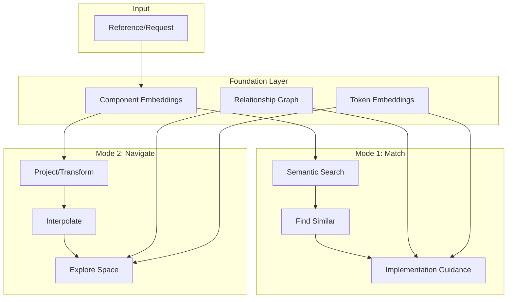
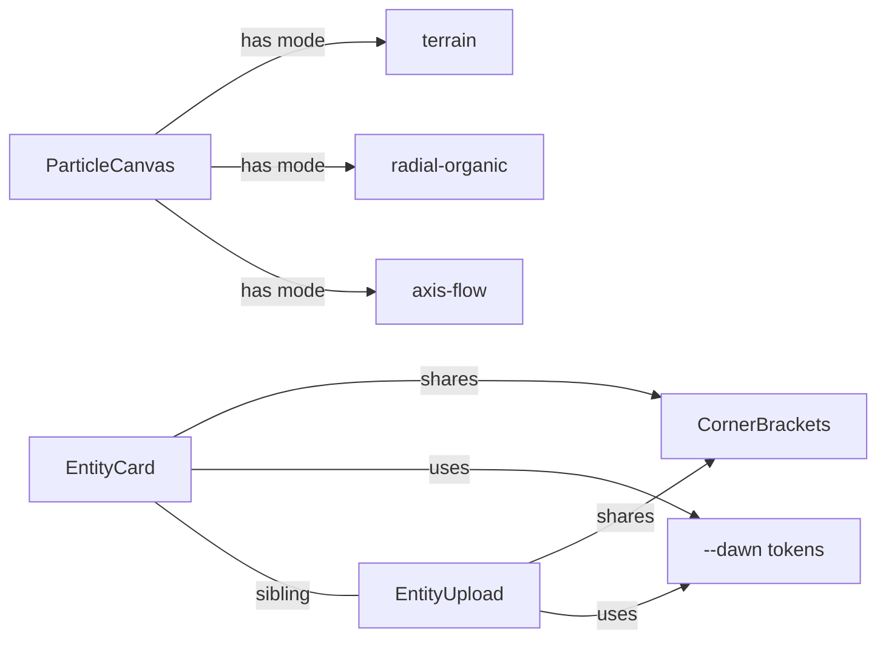

# Semantic Design Navigation System

## Two Complementary Modes



---

## The Two Modes

### Mode 1: Match (Grounded Search)

**"I have this reference, help me implement it"**

- Upload reference → find similar existing components
- "This wireframe pattern is similar to your ParticleCanvas terrain mode"
- Get implementation guidance: which tokens, patterns, components to use
- Practical, actionable, grounded in your actual codebase

### Mode 2: Navigate (Generative Exploration)  

**"I have this reference, show me the possibilities"**

- Upload reference → project how it WOULD express in Thoughtform
- Interpolate between two design points
- Explore the space with semantic parameters
- Generate new positions in your design space

**These modes complement each other:**

- Match tells you what EXISTS
- Navigate shows you what's POSSIBLE
- Both use the same embedded foundation

---

## Foundation Layer (Shared)

### 1. Component Embeddings

Every component gets a rich embedding capturing:

- Purpose and use cases
- Visual characteristics (from code comments, CSS)
- Tokens used, patterns applied
- Relationships to siblings

**Files to embed:**

- All components from [`components/`](components/) in brandworld
- Live components from Atlas (`atlas:src/components/`)
- Live components from Ledger (`ledger:src/components/`)
- Mockups from [`components/mockups/`](components/mockups/)

### 2. Token Embeddings with Semantic Context

Not just `--gold: #CAA554` but:

```javascript
gold: navigation accent, instrument surfaces, astrolabe primary
      warm, metallic, authority, wayfinding
      used in: NavigationCockpit, InstrumentPanel, axis-flow particles
```


### 3. Relationship Graph



---

## Mode 1: Match (Implementation)

### How it works:

1. **Extract** - Analyze reference for visual characteristics
2. **Search** - Find similar embedded components
3. **Map** - Identify relevant tokens and patterns
4. **Guide** - Suggest implementation approach

### Example Flow:

```javascript
You: [Upload wireframe terrain image]

System (Match Mode):
━━━━━━━━━━━━━━━━━━━━━━━━━━━━━━━━━━━━━━━━━━━━━━━━
SIMILAR COMPONENTS:
• ParticleCanvas (terrain behavior) - 0.87 similarity
• HeroLayoutExploration.html - 0.72 similarity
• NavigationGrid - 0.65 similarity

RELEVANT TOKENS:
• --gold (wireframe lines)
• --void (background)
• GRID=3 (pixel snapping)

IMPLEMENTATION PATH:
→ Extend ParticleCanvas with new "terrain" behavior
→ Use updateAxisFlow pattern for movement
→ Reference: HeroLayoutExploration.html lines 234-280
━━━━━━━━━━━━━━━━━━━━━━━━━━━━━━━━━━━━━━━━━━━━━━━━
```

---

## Mode 2: Navigate (Exploration)

### Capability A: Projection

**Transform a reference INTO the Thoughtform design language**Not "this is similar to X" but "here's how X would EXPRESS as Thoughtform"

```javascript
You: [Upload oscilloscope reference]

System (Project Mode):
━━━━━━━━━━━━━━━━━━━━━━━━━━━━━━━━━━━━━━━━━━━━━━━━
PROJECTED EXPRESSION:

As Atlas component:
• Organic waveform as entity vital signs
• Dawn glow pulse, void background
• Corner brackets framing the readout

As Ledger component:
• Terminal-style with scanline overlay
• Verde accent on signal peaks
• Monospace labels, horizontal flow

As Astrolabe component:
• Navigation instrument aesthetic
• Gold trace on brass-tinted display
• Integrated into cockpit HUD
━━━━━━━━━━━━━━━━━━━━━━━━━━━━━━━━━━━━━━━━━━━━━━━━
```


### Capability B: Interpolation

**Blend between two design points**

```javascript
You: "Create something between EntityCard and StatCard"

System (Interpolate):
━━━━━━━━━━━━━━━━━━━━━━━━━━━━━━━━━━━━━━━━━━━━━━━━
INTERPOLATION SPACE:

0.0 ◆━━━━━━━━━━━━━━━━━━━━━━━━━━━━━◆ 1.0
EntityCard                      StatCard

At 0.3: Specimen card with embedded metrics
At 0.5: Data card with entity imagery header
At 0.7: Stat display with organic borders

Shared elements preserved:
• Corner brackets (both use)
• Monospace labels
• Void background
━━━━━━━━━━━━━━━━━━━━━━━━━━━━━━━━━━━━━━━━━━━━━━━━
```


### Capability C: Parameter Exploration

**Navigate design space with semantic sliders**

```javascript
DESIGN SPACE NAVIGATION:
━━━━━━━━━━━━━━━━━━━━━━━━━━━━━━━━━━━━━━━━━━━━━━━━

Terminal ◆━━━━━━●━━━━━━━━━━━━━━━◆ Organic
         [current: 0.3]

Minimal  ◆━━━━━━━━━━━●━━━━━━━━━◆ Dense
         [current: 0.6]

Cool     ◆━━━━━━━━━━━━━━━━●━━━━◆ Warm
         [current: 0.8]

Current position suggests:
• Atlas dialect (organic + warm)
• Use dawn tones, radial particles
• Soft edges allowed, breathing animation
━━━━━━━━━━━━━━━━━━━━━━━━━━━━━━━━━━━━━━━━━━━━━━━━
```

---

## Data Structures

### Component Embedding Schema

```typescript
interface ComponentEmbedding {
  id: string;
  path: string;
  repo: string;
  
  // For matching
  description: string;
  visualCharacteristics: string;
  usesTokens: string[];
  usesPatterns: string[];
  relatedComponents: string[];
  
  // For navigation
  semanticPosition: {
    terminal_organic: number;      // -1 to 1
    minimal_dense: number;
    cool_warm: number;
    static_animated: number;
  };
  
  // Raw embedding
  embedding: number[];
  
  platform: string;
}
```


### Design Space Definition

```typescript
interface DesignSpaceAxis {
  name: string;
  negative: string;  // "terminal"
  positive: string;  // "organic"
  
  // How tokens/patterns shift along this axis
  tokenGradient: {
    negative: string[];  // ["--verde", "monospace", "scanlines"]
    positive: string[];  // ["--dawn", "serif-accent", "breathing"]
  };
}
```

---

## Implementation Phases

### Phase 1: Foundation

- Extract and embed all components across repos
- Build relationship graph from imports and shared patterns
- Calculate semantic positions for each component

### Phase 2: Match Mode

- Implement reference analysis (extract visual characteristics)
- Build semantic search across component embeddings
- Create implementation guidance generator

### Phase 3: Navigate Mode

- Implement projection (reference → platform expressions)
- Build interpolation between components
- Create parameter-based exploration interface

### Phase 4: MCP Integration

- `match_reference` - Find similar components, get implementation guidance
- `project_reference` - Show how reference would express per platform
- `interpolate_designs` - Blend between two design points
- `explore_space` - Navigate with semantic parameters

---

## Key Files

### To Modify:

- [`scripts/embed-corpus-local.ts`](scripts/embed-corpus-local.ts) - Rewrite for component extraction
- [`mcp-server/src/embeddings-local.ts`](mcp-server/src/embeddings-local.ts) - New schema with semantic positions
- [`mcp-server/src/index.ts`](mcp-server/src/index.ts) - New tools for both modes

### To Create:

- `scripts/extract-components.ts` - Component extraction with semantic analysis
- `semantic/design-space.json` - Axis definitions and token gradients
- `semantic/component-graph.json` - Relationship graph storage

---

## The Vision

Like Inkwell's embeddings are "groundtruth clay" that can be projected into any game form, your component embeddings become the groundtruth for Thoughtform design:

1. **Match**: "This reference is like EntityCard" (find what exists)
2. **Project**: "Here's how it would express in Atlas vs Ledger" (transform across contexts)
3. **Interpolate**: "Blend between these two approaches" (navigate the space)
4. **Explore**: "Move toward more organic, warmer" (semantic steering)